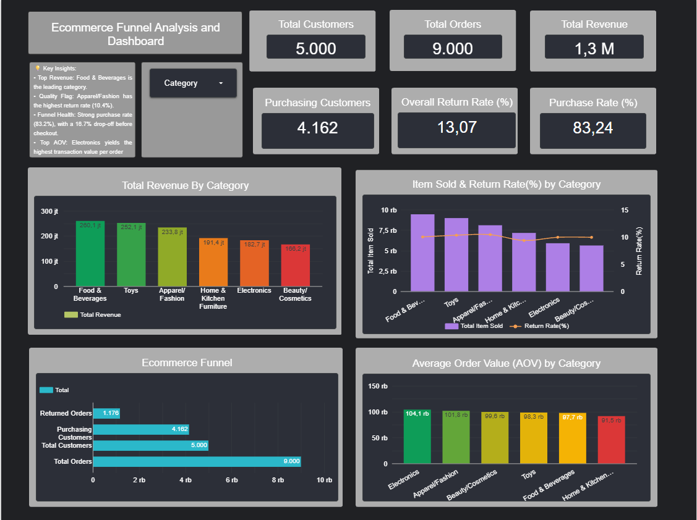

# 🛒 E-Commerce Funnel & Category Performance Analysis

## 📌 Project Overview
Proyek ini merupakan analisis data end-to-end untuk platform e-commerce, berfokus pada identifikasi kebocoran pendapatan (revenue leakage) melalui evaluasi **Conversion Funnel** dan **Return Rate (Tingkat Retur)**. 

Analisis ini membantu tim bisnis memahami seberapa efektif perjalanan pelanggan dari kunjungan hingga pembelian, serta mengidentifikasi kategori produk mana yang menghasilkan pendapatan tertinggi berbanding lurus dengan tingkat pengembalian barangnya.

## 🛠️ Tech Stack
* **Database:** PostgreSQL (pgAdmin) untuk ekstraksi dan transformasi data.
* **Data Visualization:** Looker Studio untuk pembuatan dashboard interaktif.
* **Language:** SQL (CTEs, JOINs, Aggregations, Subqueries).

## 📊 Key Business Questions Answered
1. Berapa persentase pelanggan yang berhasil dikonversi menjadi pembeli?
2. Berapa tingkat retur pesanan secara keseluruhan?
3. Kategori produk mana yang menyumbang pendapatan (revenue) terbesar?
4. Kategori produk mana yang memiliki tingkat retur tertinggi dan membutuhkan evaluasi kualitas (Quality Control)?

## 📁 SQL Queries Breakdown

Kode SQL lengkap dapat dilihat di dalam folder `sql_queries/`. Berikut adalah penjelasan masing-masing metrik yang diekstrak:

### 1. Funnel Summary & Conversion Rates
Kueri ini menggunakan CTE (`WITH FunnelMetrics`) untuk menghitung metrik utama pada corong penjualan secara global:
* Mengambil total pelanggan (`total_customers`).
* Menghitung pelanggan yang melakukan pembelian (`purchasing_customers`).
* Menghitung total pesanan (`total_orders`)[cite: 1].
* Menghitung jumlah pesanan yang diretur dengan melakukan *JOIN* antara tabel `orders`, `order_items`, dan `returns` (`returned_orders`)[cite: 1].
* Mengkalkulasi **Purchase Conversion Rate (%)** dan **Order Return Rate (%)**[cite: 1].

### 2. Category Performance
Kueri ini menganalisis performa penjualan di tingkat kategori produk[cite: 1]:
* Menghitung total barang yang terjual (`total_items_sold`)[cite: 1].
* Mengkalkulasi total pendapatan (`total_revenue`) berdasarkan harga satuan dan kuantitas[cite: 1].
* Mengurutkan hasil berdasarkan pendapatan tertinggi untuk melihat pendorong utama bisnis[cite: 1].

### 3. Return Rate by Category
Kueri investigasi mendalam untuk menemukan area bermasalah[cite: 1]:
* Menggunakan `LEFT JOIN` ke tabel `returns` untuk menghitung rasio barang yang dikembalikan per kategori[cite: 1].
* Membandingkan total baris pesanan (`total_order_lines`) dengan baris pesanan yang diretur (`returned_lines`)[cite: 1].
* Menghasilkan **Category Return Rate (%)** untuk menemukan anomali produk[cite: 1].

## 📈 Dashboard Visualization

*Dashboard ini dibangun menggunakan metrik hasil kueri di atas untuk memberikan pantauan interaktif secara real-time terhadap performa kategori dan kesehatan funnel.*

---
**Author:** Sandy Aprilyanto | Data Analyst
